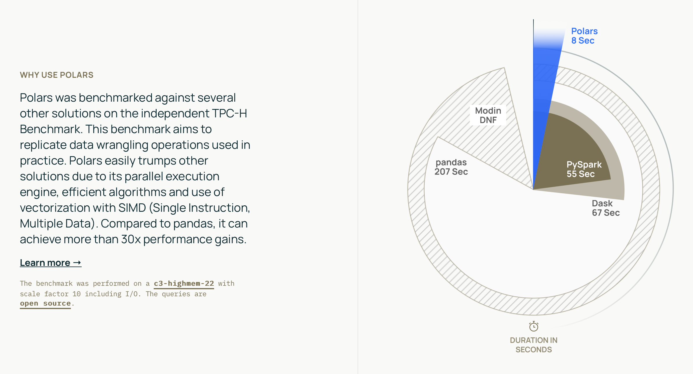

# [``polars``]

Xử lý DataFrame lớn, dễ sử dụng, hiệu năng cao và có nhiều ưu điểm giống với Pandas nổi tiếng. Polars cũng được hỗ trợ trên Python.



## Cài đặt

```bash
cargo add polars
```

Hoặc

```toml
# File: Cargo.toml

[dependencies]
polars = { version = "x", features = ["lazy", ...]}
```

## Ví dụ

```rust
use std::fs::File;

use chrono::prelude::*;
use polars::prelude::*;

let mut df: DataFrame = df!(
    "integer" => &[1, 2, 3],
    "date" => &[
            NaiveDate::from_ymd_opt(2025, 1, 1).unwrap().and_hms_opt(0, 0, 0).unwrap(),
            NaiveDate::from_ymd_opt(2025, 1, 2).unwrap().and_hms_opt(0, 0, 0).unwrap(),
            NaiveDate::from_ymd_opt(2025, 1, 3).unwrap().and_hms_opt(0, 0, 0).unwrap(),
    ],
    "float" => &[4.0, 5.0, 6.0],
    "string" => &["a", "b", "c"],
)
.unwrap();
println!("{}", df);
```

## References

- https://pola.rs

[``polars``]: ttps://pola.rs